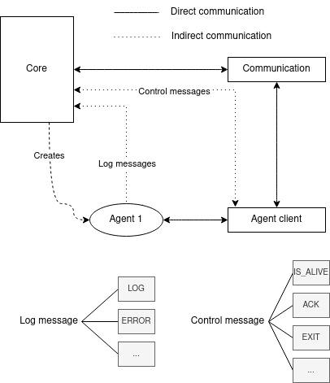
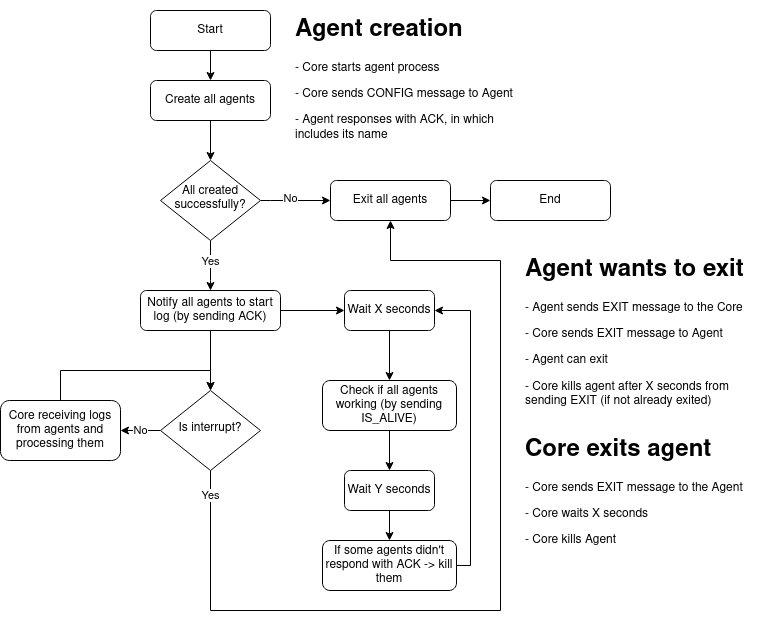

# Program documentation
This program can be used to log GNU/Linux systems.
Processes collecting logs are called agents.

You can select, which agents will be collecting in file `agents-list.conf`.
On each line must be path to folder (folder name cannot contain empty spaces), in which is agent executable with same name as the folder.
You can use `#` as a comment.

You can configure agents with their config files - settings like how often take log, which values are considered as error etc.

After start, enabled agents are created and they collect logs. These logs are saved in `logs/` folder, which is created after program termination.

## How to use
You can select, which agents will be compiled in file `agents-to-compile.json`.
Then compile all with:

`mkdir build && cd build && cmake .. && make`

In built folder file `agents-enabled.conf`, you can enable/disable agents, that will be used during runtime (simply delete line or comment with `#` character).
Now you can run with `./modulog`.

## Dependencies
Look at the [Dependencies.cmake].
Agents have their dependencies inside their folder.

# Create own agent
You can look in [agents folder link] to find out, how to create agents.
In CMake, just link it against `agent_client_lib`, then in code initialize client and start sending logs.
Agent folder must have the same name as the executable inside.
You can enable client debug mode when creating agent - in AgentClient constructor, pass `true` to `isDebug` parameter.
With this, you can use agent standalone without core (client will just print to output, what would be sent).

When is agent ready to use, you can add path to directory to the file [agents-to-compile.json]. 
**In this directory must be executable with same name as the directory name.**
When you have got same CMake structure as built-in agents, main CMake will take care of compiling everything and agent should be built automatically.

# How it works
This is, how architecture of modulog looks like: 

And also flowchart diagram:

# Cross-compiling
* when program throws error "GLIBCXX_3.4.26 not found" you have to update libstdc++6

## Raspberry Pi 4
* install arm-linux-gnueabihf (version 9.3.0 working on RPI OS Bullseye having GCC 10.2.1)
* copy /lib, /opt, /usr folders from Rpi to local folder (in our case called "rootfs")
* through cmd or in file `rpi-toolchain-file.cmake` specify path to this folder (variable `CMAKE_FIND_ROOT_PATH` and `CMAKE_SYS_ROOT`)
* now you can build:
   * `mkdir build`
   * `cd build`
   * `cmake -DCMAKE_TOOLCHAIN_FILE=../toolchains/raspberry_toolchain.cmake -DCMAKE_SYSROOT=/path/to/sysroot -DCMAKE_INSTALL_PREFIX="someDir" ..`
   * `make -j 8 install`
   * output in `someDir` can be moved to RPI

## aarch64 architecture
* install `gcc-aarch64-linux-gnu` (tested version 9.3.0)
* rest same as above, just modify cmake variable `-DCMAKE_TOOLCHAIN_FILE=../toolchains/aarch_toolchain.cmake`

---

## Pitfalls we will work on
1. Not the most effective - like sending logs in json etc.
2. Not rotating log files
3. Not the best agent ending

[agents folder link]: agents
[agents-to-compile.json]: agents-to-compile.json
[Dependencies.cmake]: cmake/Dependencies.cmake

# END PROGRAM DOCUMENTATION (continuing just some notes)

---

---

---

# Test cases
* if agent freezes - will it kill him? (also with more agents)
* if is logging correctly? and errors?
* logging with a lot of agents and big log frequency
* Test it with valgrind?
* 

# Already existing tools - research

### Zabbix
Cons:
1. hard configuration - takes time to all setup - have to install and configure server, database and agents 
1. hard to use - reviews tell, that documentation is bad and you have to use it for long time to understand it
1. uses database to store configuration and data - more difficult to manipulate with it

### Nagios
Cons:
1. Big system requirements: 20 GB of free hard drive space, 2 GB memory
1. hard to configure

### Munin
Cons:
1. set time interval between logs?
1. key-value plugin?
1. mainly for visualisation in graphs - cannot sort messages like DEBUG, INFO, ERR. and cannot set watchdogs (if is value > x - tell me about it in some general log file)

### Datadog
Cons:
1. paid
2. for observing cloud-scale applications

---

# Which libraries to use - research

### Process handling libraries
**sheredom/subprocess.h**

- Is header-only
- No ability to send SIGTERM
- No error if starting not existing script

**eidheim/tiny-process-library**

- Last commit 10 months ago - not too much updated
- doesn't look too profi

**boost, POCO**

- too huge

**DaanDeMeyer/reproc**

- seems pretty good

---

## Osnova BP
# Teoretická část
## Napsat požadavky firmy
## Výběr technologií 
## Proč existující nevyhovují + větší porovnání
## Meziprocesní komunikace - výhody/nevýhody + proč TCP nejlepší
## 

# Praktická část
## Diagramy + vysvětlení principu
## Popis struktury projektu???
## Testování - real + GTesty
## Analýza výkonu
